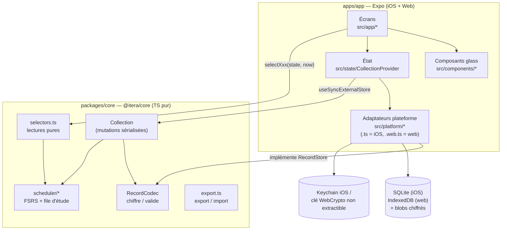
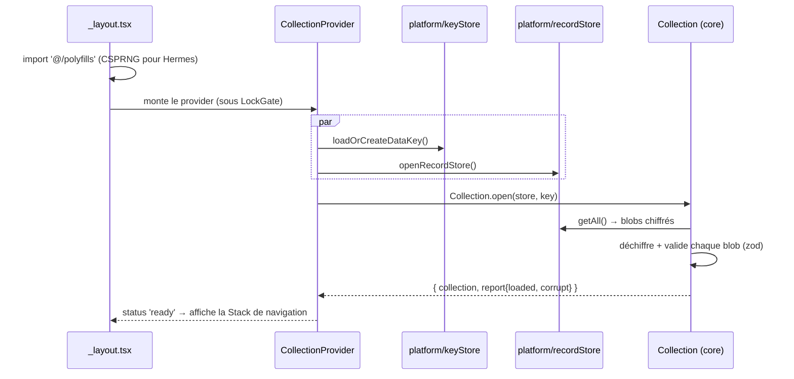
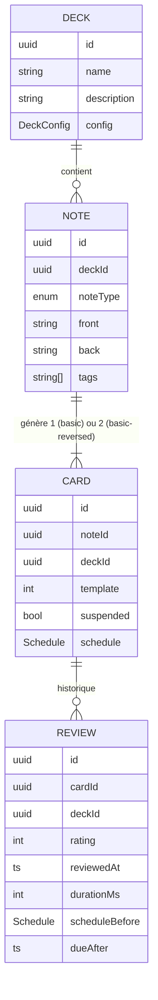

# Fiche de suivi — Itera

> Document de reprise du projet. Objectif : qu'un·e développeur·se qui n'a jamais vu
> le code puisse, en une heure, comprendre les technologies, l'architecture, la façon
> dont les modules interagissent, et livrer une modification en sécurité.
>
> **À maintenir à jour à chaque changement structurant** (voir §15 « Journal »).

| | |
|---|---|
| Version | 0.2.0 |
| Dernière mise à jour | 2026-09-25 |
| Plateformes | iOS (prioritaire) · Web · *(plus tard : Windows / macOS / Linux)* |
| Documents liés | [SECURITE.md](SECURITE.md) · [RGPD.md](RGPD.md) · [adr/](adr/) · [../SECURITY.md](../SECURITY.md) |

---

## Sommaire

1. [Le produit en bref](#1-le-produit-en-bref)
2. [Démarrage rapide](#2-démarrage-rapide)
3. [Stack technique](#3-stack-technique)
4. [Architecture](#4-architecture)
5. [Arborescence commentée](#5-arborescence-commentée)
6. [Modèle de données](#6-modèle-de-données)
7. [Les flux principaux, pas à pas](#7-les-flux-principaux-pas-à-pas)
8. [Planification des révisions (FSRS)](#8-planification-des-révisions-fsrs)
9. [Sécurité — résumé](#9-sécurité--résumé)
10. [RGPD — résumé](#10-rgpd--résumé)
11. [Design « glass »](#11-design-glass)
12. [Qualité : tests, CI, conventions](#12-qualité--tests-ci-conventions)
13. [Recettes « comment faire… »](#13-recettes-comment-faire)
14. [Limites connues et feuille de route](#14-limites-connues-et-feuille-de-route)
15. [Journal des modifications](#15-journal-des-modifications)

---

## 1. Le produit en bref

Itera est un clone d'Anki : des **paquets** contiennent des **notes** (recto/verso) qui
génèrent des **cartes** ; l'utilisateur révise les cartes dues et note sa réponse
(*À revoir / Difficile / Correct / Facile*) ; l'algorithme **FSRS** calcule la prochaine
échéance de chaque carte.

Principes non négociables :

- **Local-first** : tout fonctionne hors ligne, sans compte. Aucun serveur aujourd'hui.
- **Chiffrement de bout en bout du stockage** : chaque enregistrement est chiffré
  individuellement avant d'être écrit sur disque ; seule l'app, avec la clé du
  trousseau, peut le lire.
- **Aucune collecte** : pas d'analytics, pas de traceur, pas de pub, pas de crash
  reporter tiers. → La conformité RGPD reste simple tant que ce principe tient.
- **Contenu en texte brut** : les cartes ne sont jamais interprétées comme du HTML
  (supprime toute la classe XSS qu'Anki doit gérer).
- **Design « verre liquide »** : surfaces translucides (Liquid Glass natif sur iOS 26),
  fond animé, animations à ressort.

Fonctionnalités de la v0.1 : paquets (création, réglages, suppression), notes simples ou
recto↔verso, étiquettes, suspension, session d'étude avec retournement 3D + raccourcis
clavier web + annulation, statistiques (rétention 30 j, série), export JSON, sauvegarde
chiffrée par phrase de passe, import (fusion/remplacement), effacement total, verrouillage
Face ID, masquage dans le sélecteur d'apps iOS.

## 2. Démarrage rapide

Prérequis : **Node 22** (`.nvmrc`), npm 10. Pour iOS : un Mac avec Xcode, ou EAS Build.

```bash
npm install                    # installe tout le monorepo (workspaces npm)
npm test                       # tests unitaires du cœur (Vitest)
npm run check                  # typecheck + lint + tests (à lancer avant chaque commit)

npm run web                    # app web en dev → http://localhost:8081
npm run ios                    # app iOS (nécessite un « development build », voir ci-dessous)

npm run build:web              # build web statique → apps/app/dist
cd apps/app && npm run test:e2e:web   # test de bout en bout du build web sous CSP de prod
```

**iOS** : l'app utilise des modules natifs absents d'Expo Go (SQLite, SecureStore,
Liquid Glass…). Il faut un *development build* :
`cd apps/app && npx expo run:ios` (Mac) ou `npx eas-cli build --profile development --platform ios`.
Les dossiers `ios/`/`android/` sont **générés** (Continuous Native Generation) : ne jamais
les modifier à la main, tout se configure dans `apps/app/app.json`.

> ⚠️ Pour ajouter une dépendance Expo, toujours utiliser `npx expo install <paquet>` (dans
> `apps/app`) : il choisit la version compatible avec le SDK. Les versions sont épinglées
> (`.npmrc` → `save-exact`).

## 3. Stack technique

| Couche | Technologie | Pourquoi |
|---|---|---|
| Langage | **TypeScript** strict (`noUncheckedIndexedAccess`) | Un seul langage partout ; erreurs attrapées à la compilation. |
| App iOS + Web | **Expo SDK 57** / **React Native 0.86** / **React 19** | Une seule base de code pour iOS et web ; desktop possible plus tard (voir §14). |
| Navigation | **Expo Router** (routes = fichiers dans `src/app/`) | Deep links et URLs web gratuits. |
| Animations | **Reanimated 4** (thread UI) | Fluidité à 120 Hz, ressorts, retournement 3D. |
| Effet verre | **expo-glass-effect** (iOS 26 Liquid Glass), **expo-blur** (iOS < 26), CSS `backdrop-filter` (web) | Rendu natif quand il existe, repli propre sinon. |
| Optimisation | **React Compiler** activé | Mémoïsation automatique → rendus purs obligatoires (voir §12). |
| Logique métier | Paquet **`@itera/core`** (TS pur, aucune dépendance React/Expo) | Testable sous Node, réutilisable par un futur client desktop ou serveur. |
| Validation | **zod 4** | Toute donnée lue du disque ou d'un fichier est validée. |
| Planification | **ts-fsrs 5** (FSRS-6, l'algorithme d'Anki moderne) | État de l'art, bien testé. |
| Chiffrement | **@noble/ciphers** (XChaCha20-Poly1305), **@noble/hashes** (Argon2id) | Bibliothèques auditées, pur JS, comportement identique sur toutes les plateformes. |
| Stockage iOS | **expo-sqlite** + **expo-secure-store** (Keychain) | Transactions atomiques ; clé protégée par le Secure Enclave/Keychain. |
| Stockage Web | **IndexedDB** + **WebCrypto** (clé d'enveloppe non extractible) | Natif navigateur, aucune dépendance. |
| Tests | **Vitest** (cœur), **Playwright** (e2e web) | Rapides ; e2e exécuté sous la vraie CSP. |
| CI | GitHub Actions (tests, audit, CodeQL, gitleaks, dependency review), Dependabot | Sécurité de la chaîne d'approvisionnement. |

## 4. Architecture

### 4.1 Vue d'ensemble



**Règle de dépendance** : `apps/app` dépend de `@itera/core`, jamais l'inverse. Le cœur
ne connaît ni React, ni Expo, ni le système de fichiers : il reçoit un `RecordStore`
(interface) et une clé de 32 octets.

### 4.2 Les trois couches

1. **`@itera/core`** — le « cerveau ». Modèle de données, règles métier, FSRS,
   chiffrement, export/import. 100 % testé sous Node. Point d'entrée unique :
   `packages/core/src/index.ts` (l'app n'importe **que** depuis `@itera/core`).
2. **Adaptateurs plateforme** (`apps/app/src/platform/`) — tout ce qui dépend de l'OS.
   Chaque module existe en deux versions : `xxx.ts` (iOS/natif) et `xxx.web.ts` (web).
   Metro choisit automatiquement le bon fichier selon la plateforme. Les deux versions
   **doivent exporter les mêmes fonctions avec les mêmes signatures**.
3. **UI** (`apps/app/src/app`, `components`, `theme`, `i18n`) — écrans et composants.

### 4.3 Comment les modules interagissent (cycle de vie)



- **Lecture** : un écran appelle `useCollectionState()` (snapshot immuable) puis des
  sélecteurs purs `selectStudyQueue(state, deckId, now)`, `selectStats(...)`, etc.
  L'heure vient de `useNow()` (jamais `Date.now()` pendant le rendu).
- **Écriture** : un écran appelle une méthode de `useCollection()` (`addNote`, `answer`…).
  La `Collection` valide, **écrit d'abord sur disque (commit atomique)**, puis remplace
  son snapshot et notifie les abonnés → React re-rend.

## 5. Arborescence commentée

```
.
├── package.json              Monorepo npm workspaces + scripts globaux (check, test, web, ios)
├── .npmrc / .nvmrc           Versions exactes, Node 22
├── .github/                  CI (ci.yml), CodeQL, Dependabot
├── SECURITY.md               Politique de divulgation des vulnérabilités
├── docs/
│   ├── FICHE_DE_SUIVI.md     ← ce document
│   ├── SECURITE.md           Modèle de menaces, mesures, crypto, checklist de release
│   ├── RGPD.md               Conformité, registre, droits, plan « si l'app décolle »
│   └── adr/                  Décisions d'architecture (1 fichier = 1 décision)
├── packages/core/            @itera/core — logique métier pure
│   ├── src/
│   │   ├── index.ts          API publique (seul point d'import autorisé)
│   │   ├── collection.ts     Service principal : lecture/écriture, undo, import, effacement
│   │   ├── selectors.ts      Lectures pures (state, now) → utilisables pendant le rendu
│   │   ├── export.ts         Format d'export v1, chiffrement par phrase de passe, intégrité
│   │   ├── stats.ts          Compteurs, rétention 30 j, série de jours
│   │   ├── format.ts         Libellés d'intervalles (« 10m », « 4d »…)
│   │   ├── errors.ts         IteraError + codes stables
│   │   ├── ids.ts            UUID v4 depuis le CSPRNG
│   │   ├── validate.ts       zod → IteraError('VALIDATION') sans fuite de contenu
│   │   ├── crypto/           aead (XChaCha20-Poly1305), kdf (Argon2id), random, encoding
│   │   ├── model/            schemas (zod = source de vérité des types), limits, text (nettoyage)
│   │   ├── scheduler/        fsrs (adaptateur ts-fsrs), queue (file d'étude), day (jour à 4 h)
│   │   └── storage/          types (RecordStore), codec (chiffre+valide), memory (tests)
│   └── test/                 Vitest : crypto, scheduler, collection, export
└── apps/app/                 @itera/app — Expo
    ├── app.json              Config Expo : bundle id, plugins, Face ID, manifest de confidentialité
    ├── public/               Copié tel quel dans le build web :
    │   ├── _headers              en-têtes HTTP de sécurité (CSP, HSTS…)
    │   ├── manifest.webmanifest  app web installable (écran d'accueil)
    │   ├── sw.template.js        service worker (mode hors ligne) → dist/sw.js
    │   └── icons/                icônes de l'app web
    ├── scripts/              build-sw (génère sw.js), serve-web (sert dist/ avec la CSP), e2e-web, csp-hash
    └── src/
        ├── polyfills.ts      crypto.getRandomValues sur iOS (expo-crypto)
        ├── app/              ROUTES (Expo Router) — chaque fichier = un écran
        │   ├── _layout.tsx       Racine : providers, LockGate, écran de chargement
        │   ├── +html.tsx         Squelette HTML web (lang=fr, meta)
        │   ├── index.tsx         Accueil : liste des paquets
        │   ├── deck/index.tsx    Paquet (?id=) : compteurs, « Étudier », liste des cartes
        │   ├── deck/settings.tsx Réglages du paquet (?id=)
        │   ├── note/edit.tsx     Création (?deckId=) / édition (?noteId=) d'une carte
        │   ├── study.tsx         Session d'étude (?id=)
        │   ├── settings.tsx      Sécurité, export/import, effacement
        │   └── privacy.tsx       Politique de confidentialité in-app
        ├── components/       UI : GlassSurface(.ios/.web), GlassButton, Background, Screen…
        ├── platform/         Adaptateurs OS : keyStore, recordStore, files, appLock, dialog, haptics, offline
        ├── state/            CollectionProvider, useNow, errors (messages utilisateur)
        ├── theme/            Jetons de design (couleurs clair/sombre, rayons, typo)
        └── i18n/fr.ts        Tous les textes affichés
```

## 6. Modèle de données

Source de vérité : `packages/core/src/model/schemas.ts` (les types TS sont inférés des
schémas zod). Dates = millisecondes epoch UTC. Identifiants = UUID v4.



- `DeckConfig` : `newPerDay`, `reviewsPerDay`, `desiredRetention` (0,70–0,99),
  `maximumIntervalDays`.
- `Schedule` (état FSRS sérialisable) : `state` (0 Nouvelle, 1 Apprentissage, 2 Révision,
  3 Réapprentissage), `due`, `stability`, `difficulty`, `reps`, `lapses`, `lastReview`…
- `Review.scheduleBefore` permet l'**annulation exacte** d'une réponse et, plus tard,
  l'optimisation des paramètres FSRS sur l'historique.
- Tous les enregistrements portent `kind`, `createdAt`, `updatedAt` (`updatedAt` sert à
  la fusion lors d'un import et servira à la synchronisation).
- Limites (anti-DoS, `model/limits.ts`) : champ ≤ 20 000 caractères, 32 étiquettes, etc.

**Stockage physique** : une table/objet `records(id, payload)` où `payload` =
`[0x01][nonce 24 o][JSON chiffré + tag 16 o]`. Aucune métadonnée en clair (ni type, ni
date, ni nom). L'`id` sert de données authentifiées (AAD) : un blob déplacé vers un autre
id est rejeté.

## 7. Les flux principaux, pas à pas

**Ajouter une carte** — `note/edit.tsx` → `collection.addNote({deckId, noteType, front, back, tags})`
→ nettoyage (`model/text.ts` : caractères de contrôle, surcharges bidi, NFC) → validation
zod → création de 1 ou 2 `Card` avec `newSchedule(now)` → `store.commit({put:[note, ...cards]})`
(une transaction) → nouveau snapshot → l'écran se vide pour la carte suivante.

**Réviser** — `study/[id].tsx` :
1. `selectStudyQueue(state, deckId, now)` → la 1re carte est affichée (recto).
2. « Afficher la réponse » (ou Espace) → retournement 3D (Reanimated) → boutons avec les
   intervalles prévus (`selectAnswerPreview`).
3. Réponse → `collection.answer(cardId, rating, durée)` → `nextSchedule()` (FSRS) →
   commit atomique `{carte mise à jour, Review}` → la file est recalculée.
4. « Annuler » → `undoLastAnswer()` restaure `scheduleBefore` et supprime la `Review`.

**Exporter** — `settings.tsx` : JSON lisible (`serializeExport`) ou chiffré
(`encryptExport` : Argon2id → clé → XChaCha20-Poly1305). iOS : fichier temporaire →
feuille de partage → suppression du fichier. Web : téléchargement.

**Importer** — sélection du fichier → détection chiffré/clair → (phrase de passe) →
`parseExport` : taille max, JSON, schéma zod, **intégrité référentielle** (pas d'id
dupliqué, pas de référence orpheline) → choix « Fusionner » (la version la plus récente
selon `updatedAt` gagne) ou « Remplacer » → un seul commit atomique.

**Tout effacer** (droit à l'effacement) — `eraseEverything()` : `store.clear()`
(SQLite : `DELETE` + `secure_delete` + checkpoint WAL + `VACUUM` ; web : `clear()`),
puis **destruction de la clé** (crypto-shredding), puis nouvelle collection vide.

## 8. Planification des révisions (FSRS)

- `scheduler/fsrs.ts` est le **seul** fichier qui parle à `ts-fsrs`. Il convertit
  `Schedule` ⇄ `Card` ts-fsrs. Fuzz activé (évite que des cartes créées ensemble
  reviennent toujours ensemble), étapes courtes d'apprentissage activées (1 min, 10 min).
- `scheduler/queue.ts` — ordre de la file, comme Anki :
  1. cartes en (ré)apprentissage échues ;
  2. révisions dues avant la fin du **jour d'étude** (bascule à **4 h** du matin, heure
     locale — `scheduler/day.ts`), limitées par `reviewsPerDay` moins celles déjà faites ;
  3. nouvelles cartes, limitées par `newPerDay` moins celles déjà vues aujourd'hui.
  S'il ne reste rien, les cartes d'apprentissage dues dans les 20 min sont montrées en
  avance.
- Pistes d'évolution : optimiseur de paramètres FSRS sur l'historique (`Review`),
  ordre mélangé nouvelles/révisions, paquets hiérarchiques (`Parent::Enfant`).

## 9. Sécurité — résumé

Détails complets et modèle de menaces : **[SECURITE.md](SECURITE.md)**.

- Chaque enregistrement chiffré (XChaCha20-Poly1305, nonce aléatoire 192 bits, AAD = id).
- Clé de données 256 bits : Keychain iOS `WHEN_UNLOCKED_THIS_DEVICE_ONLY` (jamais dans
  iCloud) ; web : enveloppée par une clé WebCrypto **non extractible**.
- Tout ce qui est lu (disque, fichier importé) est **validé** ; limites de taille partout.
- Contenu des cartes rendu **en texte brut** uniquement ; `eval`, `new Function` et
  `dangerouslySetInnerHTML` interdits par le lint.
- Web : CSP stricte (`default-src 'none'`, script par hash), HSTS, anti-framing — testée
  en e2e.
- iOS : verrouillage Face ID optionnel, masquage du contenu dans le sélecteur d'apps.
- Chaîne d'approvisionnement : versions exactes, `npm ci`, audit, Dependabot, CodeQL,
  gitleaks, actions GitHub épinglées par SHA.

## 10. RGPD — résumé

Détails : **[RGPD.md](RGPD.md)**. Aujourd'hui l'éditeur **ne traite aucune donnée
personnelle** : tout reste sur l'appareil, chiffré, sans compte ni télémétrie. Les droits
sont intégrés au produit : accès/portabilité (export), rectification (édition),
effacement (bouton dédié + désinstallation). Le document RGPD contient le plan d'action
**à exécuter avant** d'ajouter tout serveur (synchronisation, comptes, analytics).

## 11. Design « glass »

- `components/GlassSurface` a trois implémentations : `.ios.tsx` (Liquid Glass natif via
  `GlassView` si iOS 26+, sinon `BlurView` matériau système), `.web.tsx`
  (`backdrop-filter: blur() saturate()` + reflet interne), `.tsx` (repli translucide).
  Toutes partagent `GlassSurface.types.ts`.
- `components/Background` : dégradé + 3 « orbes » colorées qui dérivent lentement
  (Reanimated) ; c'est ce fond que le verre floute. Respecte « Réduire les animations ».
- `components/PressableScale` : chaque élément tactile s'enfonce avec un ressort + retour
  haptique. `GlassButton` = `PressableScale` + `GlassSurface`.
- Jetons : `theme/tokens.ts` (couleurs clair/sombre, rayons, espacements, typo). Aucune
  couleur en dur dans les écrans. Couleurs des compteurs = convention Anki
  (bleu nouvelles, rouge apprentissage, vert révisions).

## 12. Qualité : tests, CI, conventions

- `npm run check` = typecheck (core + app) + lint (ESLint Expo + règles de sécurité) +
  tests. Couverture du cœur > 95 % (seuils imposés dans `vitest.config.ts`).
- E2E web (`apps/app/scripts/e2e-web.mjs`) : création → ajout → étude clavier → rechargement
  (persistance) → **réseau coupé** : l'app se charge et on ajoute une carte → vérifie
  qu'IndexedDB ne contient **aucun texte en clair** → export →
  effacement, en clair et en sombre, sous la CSP de production, 0 erreur console exigée.
- CI (`.github/workflows/ci.yml`) : ces mêmes étapes + `npm audit` (high) + gitleaks +
  dependency review ; CodeQL hebdomadaire.
- *Dependency review* ne tourne que si le dépôt a le **Dependency graph** activé
  (Settings → Code security) **et** la variable Actions `DEPENDENCY_REVIEW=true`
  (Settings → Secrets and variables → Actions → Variables).

**Conventions** :
- Écrans : **rendu pur**. Pas de `Date.now()` ni d'appel de méthode de `Collection`
  pendant le rendu → utiliser `useNow()` + sélecteurs `selectXxx(state, …)` (le React
  Compiler mémoïse sur les entrées ; une lecture cachée afficherait des données périmées).
- Valeurs partagées Reanimated : `.get()` / `.set()` (compatible React Compiler).
- Toute écriture passe par `Collection` (jamais directement par le store).
- Tout texte affiché vient de `i18n/fr.ts`. Toute couleur de `theme/tokens.ts`.
- Messages d'erreur : `state/errors.ts` → jamais de détail technique ni de contenu
  utilisateur à l'écran ou dans les logs.
- Commentaires de code en anglais, documentation en français.

## 13. Recettes « comment faire… »

**Ajouter un écran** : créer `apps/app/src/app/<route>.tsx` exportant un composant par
défaut qui utilise `<Screen>` ; naviguer avec `router.push('/<route>')`.
**Pas de segments dynamiques** (`[id].tsx`) : passer les identifiants en paramètre de
requête (`router.push({ pathname: '/deck', params: { id } })` → `/deck?id=…`). Ainsi chaque
écran est un fichier HTML statique : hébergement sans règles de réécriture et mise en
cache hors ligne simple.

**Ajouter un champ au modèle** (ex. `Note.source`) :
1. `model/schemas.ts` : ajouter le champ **avec une valeur par défaut**
   (`z.string().default('')`) pour que les anciens enregistrements restent valides ;
2. adapter `collection.ts` (construction) et, si besoin, `export.ts` ;
3. si le changement est incompatible : incrémenter `version` du format d'export et écrire
   une fonction de migration testée ; documenter dans une ADR ;
4. tests + mise à jour de cette fiche (§6).

**Ajouter une plateforme** (desktop) : réutiliser le build web dans **Tauri** (recommandé,
voir ADR-0001) et implémenter `keyStore` via le trousseau de l'OS (plugin
`tauri-plugin-stronghold` ou keyring) ; ou React Native Windows/macOS avec leurs propres
`xxx.windows.ts`/`xxx.macos.ts`.

**Mettre à jour Expo** : `cd apps/app && npx expo install expo@^<N> --fix`, puis
`npx expo-doctor`, `npm run check`, `npm run build:web`, recalculer le hash CSP
(`npm run csp:hash`) et mettre à jour `public/_headers` si besoin, e2e, test sur iPhone.

**Publier sur iOS** : `npx eas-cli build --platform ios --profile production` puis
`npx eas-cli submit`. Fiche App Store : « Données non collectées » (voir RGPD.md §6).
Vérifier la checklist de SECURITE.md §8.

**Déployer le web** : `npm run build:web` (export Expo **puis** génération de `sw.js`) →
publier `apps/app/dist` sur un hébergeur statique en HTTPS (Netlify / Cloudflare Pages
lisent `_headers` ; sinon reporter les en-têtes dans la config de l'hébergeur).
Pas-à-pas : [INSTALLER_SUR_IPHONE.md](INSTALLER_SUR_IPHONE.md). Hébergeur situé dans l'UE
de préférence, sans logs d'accès ou avec rétention courte (RGPD.md §5).

**Mode hors ligne (web)** : `platform/offline.web.ts` enregistre `/sw.js` (build de
production uniquement) et demande un stockage persistant. `scripts/build-sw.mjs` liste
tous les fichiers de `dist/` et calcule une version (hash du contenu) : à chaque nouveau
build, le navigateur installe le nouveau worker, télécharge les nouveaux fichiers et
supprime l'ancien cache. Stratégie : tout est pré-caché, puis servi « cache d'abord ».
Le worker ne met jamais en cache les données utilisateur (elles sont dans IndexedDB).

## 14. Limites connues et feuille de route

**Limites / dette** :
- Changement de téléphone : la clé ne quitte pas l'appareil → l'utilisateur **doit** faire
  une sauvegarde chiffrée et la réimporter (par choix de sécurité ; à expliquer dans l'UI
  d'onboarding).
- Web : une XSS ou une extension malveillante pourrait utiliser la clé (voir SECURITE.md).
- Argon2id en JS pur : quelques secondes sur mobile pour chiffrer/déchiffrer une sauvegarde.
- Liste des cartes d'un paquet tronquée à 200 (pas encore de recherche/virtualisation).
- Toute la collection est chargée en mémoire (OK jusqu'à ~100 k cartes ; au-delà,
  indexer et charger à la demande).
- Pas encore d'i18n autre que le français ; pas de médias (images/audio) ; pas d'import
  `.apkg` Anki ; pas de notifications de rappel.

**Feuille de route proposée** :
1. Onboarding + rappel de sauvegarde ; recherche et navigateur de cartes.
2. Import `.apkg` / CSV (dans le cœur, avec conversion HTML → texte et validation stricte).
3. Médias (images) chiffrés.
4. **Synchronisation chiffrée de bout en bout** (le serveur ne stocke que les blobs
   `StoredRecord` ; clé dérivée côté client) → déclenche le plan RGPD §7.
5. Client desktop (Tauri + build web).
6. Optimiseur FSRS personnalisé, statistiques avancées, widgets iOS.

## 15. Journal des modifications

| Date | Version | Changement |
|---|---|---|
| 2026-09-25 | 0.2.0 | Web installable et **hors ligne** (manifest, service worker pré-caché, icônes) ; routes sans segments dynamiques (`/deck?id=`, `/study?id=`) ; test e2e hors ligne ; guide d'installation iPhone. |
| 2026-09-25 | 0.1.0 | Création du monorepo : `@itera/core` (modèle, FSRS, chiffrement, export), app Expo iOS/web (UI glass, stockage chiffré, verrouillage, export/import, effacement), CI sécurité, documentation. |
